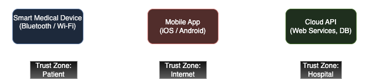

# 🛡️ Threat Modeling: Smart Medical Device Ecosystem

This project simulates a real-world threat modeling exercise focused on a smart medical device ecosystem. It uses OWASP STRIDE methodology and MITRE ATT&CK mappings to evaluate and document potential security risks — no code required. Designed to showcase practical skills in architecture analysis, threat identification, and risk mitigation.

---

## 🔧 Use Case Overview

Modern medical devices increasingly rely on cloud services, mobile apps, and wireless protocols — exposing them to new cyber threats. This project evaluates a representative ecosystem made up of:

- A **Smart Medical Device** (e.g., insulin pump or wearable heart monitor),
- A **Mobile App** used by patients or caregivers,
- A **Cloud API / Dashboard** used by healthcare providers.

The goal is to identify attack surfaces, trust boundaries, and security controls across this system using a structured and repeatable threat modeling process.

---

## 🖼️ System Architecture

Below is the high-level system overview and trust boundaries:

---

## 📁 Project Structure

| File | Description |
|------|-------------|
| `README.md` | Overview and project objectives |
| `diagrams/` | Architecture and data flow diagrams |
| `stride-analysis.md` | STRIDE threat breakdown per component |
| `mitre-mapping.md` | Mapping STRIDE threats to MITRE ATT&CK |
| `misuse-cases.md` | Potential abuse cases and attacker paths |
| `risk-matrix.md` | Risk severity scoring + mitigation |
| `resources.md` | External standards and references |

---

## 📊 Methodology

This threat model combines several industry approaches:

- **OWASP STRIDE** for identifying threats across:
  - Spoofing, Tampering, Repudiation, Information Disclosure, Denial of Service, Elevation of Privilege
- **MITRE ATT&CK Frameworks** for linking real-world TTPs to:
  - Mobile, Cloud (Enterprise), and IoT/ICS environments
- **OWASP Risk Rating** for prioritizing and scoring risks

---

## 🎯 Key Objectives

- Practice STRIDE-based threat modeling in a medical/IoT context
- Document realistic attacker behaviors using MITRE mappings
- Demonstrate risk-based thinking without writing code
- Showcase portfolio-level security analysis skills

---

## ✅ Future Enhancements

- Add Persona-based Abuse Cases (Doctor, Attacker, Insider)
- Include more granular Data Flow Diagrams (DFDs)
- Optional: NIST 800-53 or HIPAA control mapping

---

## 📚 References

See [`resources.md`](resources.md) for compliance frameworks, threat modeling tools, and MITRE links.

---

> ✨ This project is part of a larger cybersecurity portfolio focused on practical, real-world threat assessment techniques.
